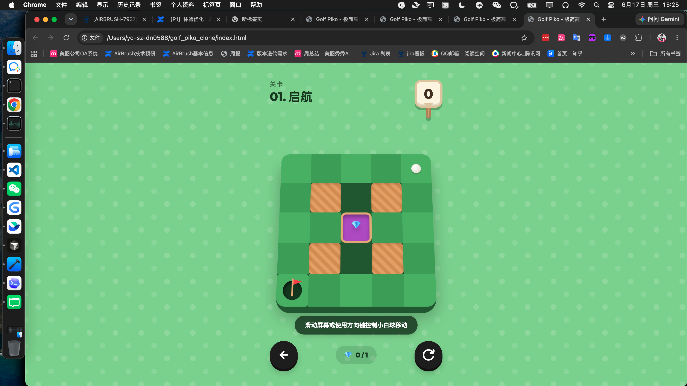

# Golf Piko - 极简高尔夫解谜游戏克隆版

一个纯前端实现的极简主义 2.5D 高尔夫逻辑解谜游戏，致敬并复刻了 iOS 独立游戏 **《Golf Piko》** 的经典视觉风格与关卡解谜体验。



## 🎮 游戏在线游玩 / 本地运行

本项目为**零依赖单页应用**，不需要配置任何 Node.js、Vite 或其他打包环境。

### 本地游玩：
直接双击 `index.html` 即可在任意浏览器中直接运行。
或者在项目根目录使用命令行启动一个简易本地服务器：
```bash
# 使用 Python 快速启动本地服务
python3 -m http.server 8000
```
然后在浏览器中打开 `http://localhost:8000` 即可。

---

## 🕹️ 操作说明

* **电脑端**：点击游戏区域激活后，使用键盘的**方向键（↑ ↓ ← →）**或 **W A S D** 键向对应的方向滑动小球。
* **移动端/触屏**：直接在屏幕上**滑屏（Swipe）**来控制小球滚动的方向。
* **规则**：
  * 滑动后小球会沿着该方向一直滚动，直到撞到**沙坑/木墙障碍**、或掉入**水池**和**终点洞口**。
  * 目标是利用反弹和关卡机制，以**最少的步数（杆数）**将小球送入插着红旗的洞口。
  * 右下角按钮可随时**重置当前关卡**，左下角按钮可以**选择关卡/返回上一关**。

---

## ✨ 核心复刻技术特色

1. **纯 CSS 变量驱动的 2.5D 视觉系统**
   * 地图并非真正的 3D 渲染，而是采用 2D Orthographic (正交) 俯视角。
   * 通过 CSS `box-shadow` 重叠投影营造出了悬浮在空中的“绿茵浮岛”板块厚度。
   * 采用 **CSS 变量 (`--cols`, `--rows`, `--col-idx`, `--row-idx`)** 绑定了关卡的网格尺寸和白球当前坐标，解决了绝对定位元素在自适应排版时的拉伸和比例偏差，使球体在任何关卡都呈现出完美的圆形与精致的 1/3 格子比例。

2. **边缘自适应大圆角算法 (Autotile Corner)**
   * 在 [game.js](game.js) 渲染网格时，会自动检测每个可见格子周围的邻居。如果格子的某个角外露（邻居为 Empty），会自动为其加上大圆角，而内部拼接面则为直角。从而拼出一整块非常光滑圆润的悬浮小岛。

3. **Web Audio API 原生音效合成 (零资源依赖)**
   * 本项目不包含任何外部音频文件。所有的音效全部在 [game.js](game.js) 中通过 Web Audio API 动态合成：
     * **滚球声**：低频正弦波包络下滑。
     * **撞墙声**：短促的三角形波模拟木质敲击。
     * **收集钻石**：双音频高频谐波。
     * **落水声**：正弦波快速扫频下滑。
     * **通关获胜**：C大调琶音上行（C5-E5-G5-C6）。

4. **多段动作队列动画 (传送门 Tunnels)**
   * 游戏包含橙色传送门（`t`/`T`）和蓝色传送门（`u`/`U`）。
   * 采用递归式**动作执行队列**设计。当小球滚入传送门 A 时，会缩成 0 并淡出，播放穿梭音效，随后在传送门 B 弹性缩放还原，并**保持原有的滑动方向和惯性继续朝前滚**，过渡丝滑且没有视觉平移穿帮。

---

## 🗺️ 关卡设计目录

* **`01. 启航`**：简单的新手引导，让玩家熟悉反弹机制。
* **`02. 激流绕行`**：引入水池（落水判定失败并重置）与沙坑阻挡。
* **`03. Piko 经典`**：**完美复刻了原作的经典关卡**。包含粉色触发按钮（踩扁按钮可激活并开启受控木门）以及多颗分布在紫色区域的钻石。
* **`04. 虫洞穿梭`**：加入双色传送门，需要利用传送门在悬空的群岛间来回折返并收集钻石。
* **`05. 终极大挑战`**：终极烧脑关卡。需要先在左侧孤岛踩下开关打通洞口，然后通过传送门到达下方独立区域收集钻石，最后完成惊险的贯穿击球进洞。
